# Week 0 — Billing and Architecture

## Required Tasks

Completely watched the Bootcamp Livestream, Spend Considerations video by Chirag and Security Considerations video by Ashish.

The spend considerations video helped me to -
 - Setup billing alarms to keep track of spending for various services on AWS

The security considerations video educated me on different security aspects on the AWS cloud - 
 - CloudTrail to monitor all the API calls made in the AWS account
 - IAM users, roles and policies 
 - Principle of least privilege
 - Enable MFA on all accounts

### Conceptual Diagram

Completed the Conceptual Design Diagram for **Cruddur** using LucidChart. This diagram depicts the arrangement and interactions between different modules that make up the application.

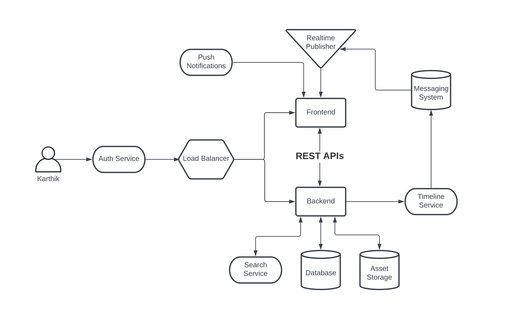

[LucidChart Link for Logical Archotectural Diagram](https://lucid.app/lucidchart/f43ae2e4-0f2f-4a2c-b102-d671160d16a0/edit?viewport_loc=-83%2C-133%2C1963%2C983%2C0_0&invitationId=inv_8359355c-4e15-40be-b5df-ee5568795a14)

### Logical Architectural Diagram

Completed the Logical Architectural Diagram for **Cruddur** using LucidChart. This diagram clearly and concisely shows the different AWS services that will be used to build the application along with third-party services.

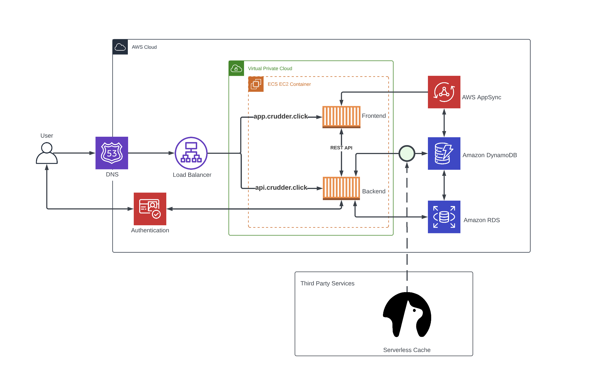

[LucidChart Link for Logical Archotectural Diagram](https://lucid.app/lucidchart/f413ef5b-1150-48b2-8041-16915f75590f/edit?viewport_loc=-890%2C-136%2C3374%2C1474%2C0_0&invitationId=inv_35e20784-6a02-4b2f-8931-abef40551f79)

### Create an Admin User and Generate AWS Credentials

Created an AWS IAM User from the root account. Enabled MFA for both root and IAM user. Created an **Admin** group and attached the **AdministratorAcess** AWS Managed Permissions Policy to the group. Added the newly created IAM user to this group which automatically granted the same permissions to the user as well.

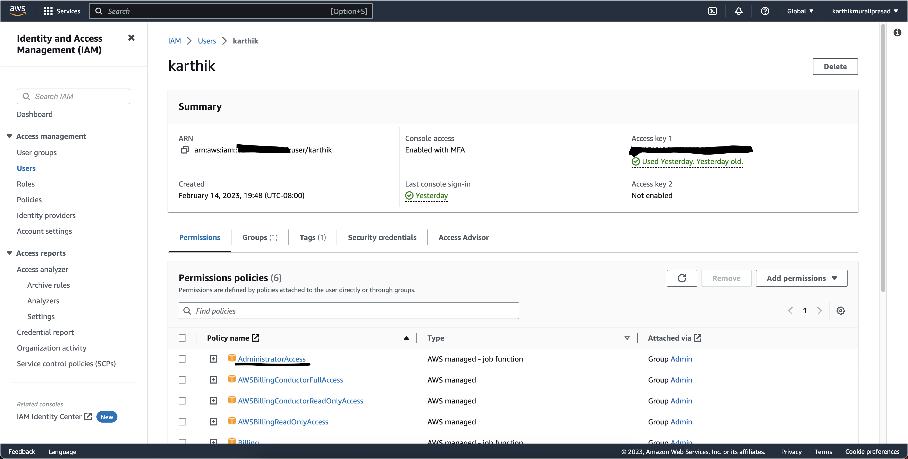

### AWS CloudShell

Used AWS CloudShell to run commands such as -

```
aws sts get-caller-identity
```
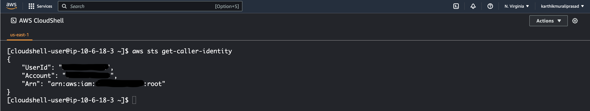

### Install AWS CLI

I followed the offical [AWS Documentation](https://docs.aws.amazon.com/cli/latest/userguide/getting-started-install.html) for installing CLI on GitPod. The following commands were added to the [.gitpod.yml](../.gitpod.yml) file so that for each session, the CLI will automatically be installed.
```
curl "https://awscli.amazonaws.com/awscli-exe-linux-x86_64.zip" -o "awscliv2.zip"
unzip awscliv2.zip
sudo ./aws/install
```

Post the installation of the AWS CLI, account configurations were added to the gitpod environments. It needs to be once and will be persisted for future sessions - 

```
# setting the persistent gitpod environment values
gp env AWS_ACCESS_KEY_ID="key_id"
gp env AWS_SECRET_ACCESS_KEY="secret_access_key"
gp env AWS_DEFAULT_REGION="us-east-1"
```
Once the relevant environment variables were set, I verified the installation by fetching AWS account details using the following command -
```
aws sts get-caller-identity
```
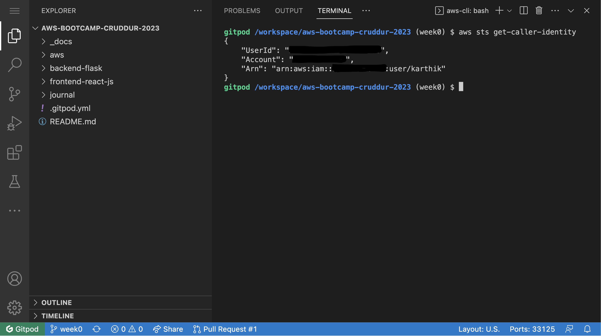

### Create a Budget

I created a budget **My Monthly Cost Budget** of $15 using the AWS CLI installed on GitPod workspace. This budget will notify me whenever spending crosses the $15 threshold. Command used to create the budget from the CLI -
```
aws budgets create-budget \
    --account-id 111122223333 \
    --budget file://budget.json \
    --notifications-with-subscribers file://notifications-with-subscribers.json
```

Two json files are used to supply the necessary information for the create budget command -
- [budget.json](../aws/json/budget.json) - This file contains all the metadata necessary for creating the budget (limit, threshold, time period)
- [notifications-with-subscribers.json](../aws/json/budget-notifications-with-subscribers.json) - This file contains the information regarding when to notify and whom (subscriber) to notify

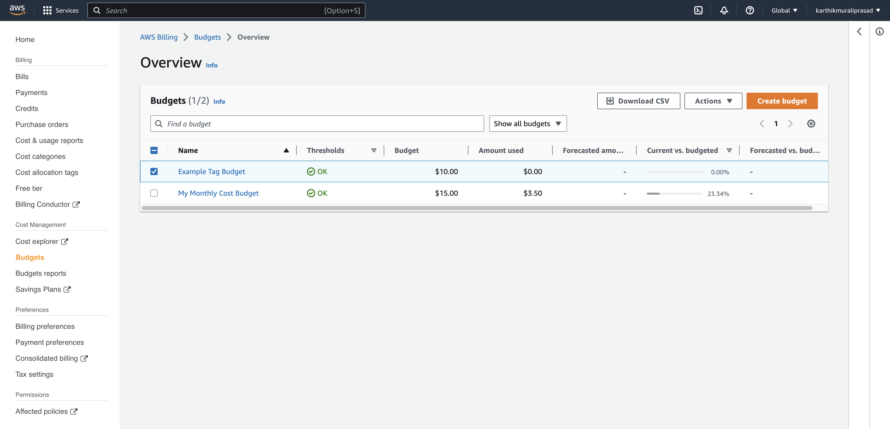

### Create a Billing Alarm

1. To create a billing alarm, I first enabled Billing Alerts to receive alerts - 
  - Root Account > [Billing Page](https://us-east-1.console.aws.amazon.com/billing/home?region=us-east-1#/preferences)
  - Under Billing Preferences check Receive Billing Alerts and other preferences
  - Save Preferences

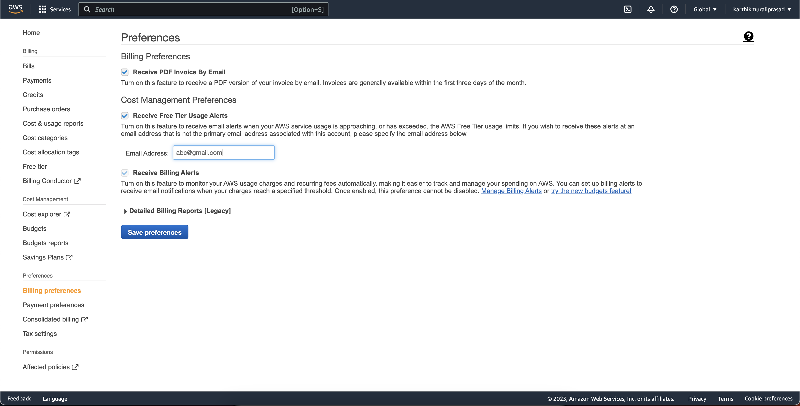

2. Creating SNS topic - When the billing alarm will be in **In Alarm** status i.e when the threshold defined in the alarm is crossed, cloudwatch will publish an alert to the SNS topic which I created in this step. This SNS topic will then publish the alert to all its subscribers, which is myself.
- I created the topic using -
  ```
  aws sns subscribe \
      --topic-arn TopicARN \
      --protocol email \
      --notification-endpoint your@email.com
  ```
- Once the topic is created, I confirmed the subscription from my email

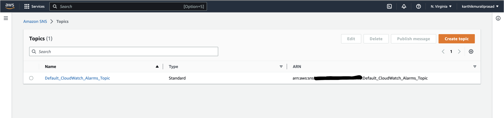

3. Creating a billing alarm using the AWS CLI. I used the following command to create the alarm -
```
aws cloudwatch put-metric-alarm --cli-input-json file://aws/json/alarm-config.json
```
- I used the file [alarm-config.json](../aws/json/alarm-config.json) to configure the alarm - specifying threshold, ComparisonOperator and EvaluationPeriods

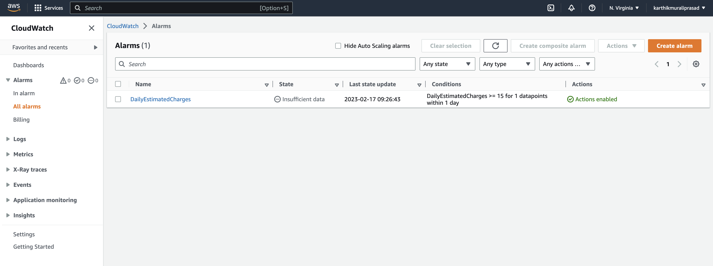


## Additional Homework Tasks Completed

Apart from the required tasks, I have completed a few additional tasks as well. 

1. I used EventBridge to hookup Health Dashboard to SNS and send notification when there is a EC2 service issue. I have configured the notifications to be sent to the SNS topic created for Billing Alarms.

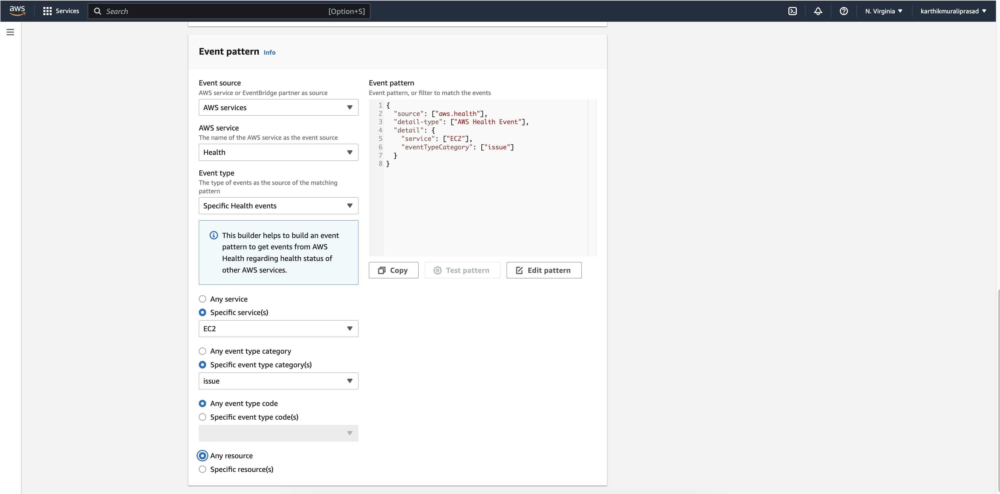
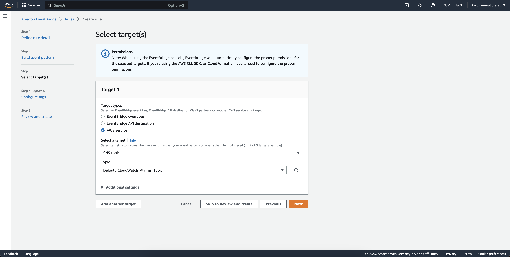
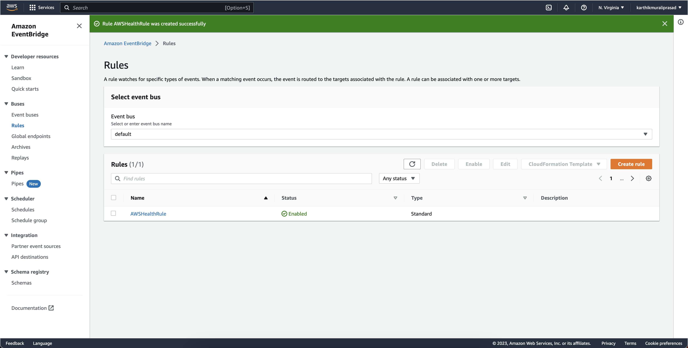

2. Review each of the pillars in the [Well Architected Framework](https://aws.amazon.com/blogs/apn/the-6-pillars-of-the-aws-well-architected-framework/)

