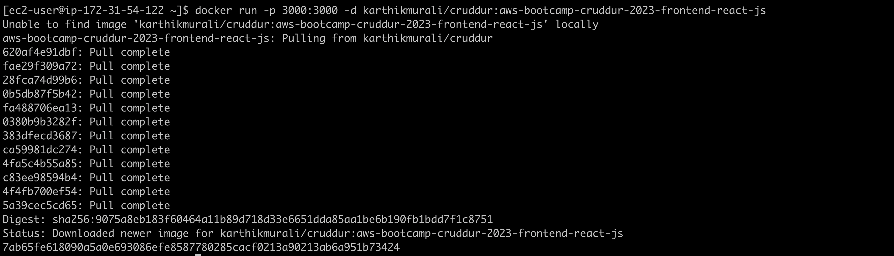

# Week 1 — App Containerization

## Required Tasks

### Videos

I watched the following videos to prepare myself for week 1 of the cloud project bootcamp -

1. Week 1 live stream 
2. Spend Considerations for week 1 by Chirag
3. Container Security Considerations by Ashish
4. Containerize the application - Dockerfile & docker-compose
5. Containerize the frontend and backend
6. Add PostgreSQL and DynamoDB local containers in the docker-compose.yml file
7. How to ask for technical help
8. Grading Homework Summaries

### Containerize Backend

#### Add a Dockerfile for Backend Flask

Added the following [Dockerfile](../backend-flask/Dockerfile) for the backend flask application.

#### Build Container

```sh
docker build -t  backend-flask ./backend-flask
```

#### Run Container

Run 
```sh
docker run --rm -p 4567:4567 -it backend-flask
```


### Containerize Frontend

#### Run NPM Install

Ran NPM Install before building the container since it needs to copy the contents of node_modules

```
cd frontend-react-js
npm i
```

#### Add a Dockerfile for Frontend ReactJS

Added the following [Dockerfile](../frontend-react-js/Dockerfile) for the frontend reactjs application.

#### Build Container

```sh
docker build -t frontend-react-js ./frontend-react-js
```

#### Run Container

```sh
docker run -p 3000:3000 -d frontend-react-js
```


### Multiple Containers

Since there are 2 containers, we need to build and run them separately for the entire application to function. A better way is to list all the containers in a docker-compose file and run them at once.

#### Create a docker-compose file

Added the following [docker-compose.yml](../docker-compose.yml) at the root of the project.

Running this file will start all the containers mentioned in the file at once.

#### Adding DynamoDB Local and Postgres

For future labs, we are going to use Postgres and DynamoDB local. Hence added these in the docker-compose file created in the previous step.

To test if the local DynamoDB works, I executed the following commands - 

1. Create a table

```sh
aws dynamodb create-table \
    --endpoint-url http://localhost:8000 \
    --table-name Music \
    --attribute-definitions \
        AttributeName=Artist,AttributeType=S \
        AttributeName=SongTitle,AttributeType=S \
    --key-schema AttributeName=Artist,KeyType=HASH AttributeName=SongTitle,KeyType=RANGE \
    --provisioned-throughput ReadCapacityUnits=1,WriteCapacityUnits=1 \
    --table-class STANDARD
```


2. Put an Item

```sh
aws dynamodb put-item \
    --endpoint-url http://localhost:8000 \
    --table-name Music \
    --item \
        '{"Artist": {"S": "No One You Know"}, "SongTitle": {"S": "Call Me Today"}, "AlbumTitle": {"S": "Somewhat Famous"}}' \
    --return-consumed-capacity TOTAL  
```


3. List Tables

```sh
aws dynamodb list-tables --endpoint-url http://localhost:8000
```

4. Get Records

```sh
aws dynamodb scan --table-name cruddur_cruds --query "Items" --endpoint-url http://localhost:8000
````


To test if the PostgreSQL local works, I executed the following commands - 

1. Gain access to PostgreSQL - 

```
psql -Upostgres --host localhost
```
2. Checked for tables, tuples, relations


### Document the Notification Endpoint in the OpenAI Document

I have added a new endoint for notifications. This API is documented along with the other APIs in the OpenAI document.


### Flask Backend Endpoint for Notifications

I have made the necessary backend changes to add the new notifications endpoint in flask


### React Page for Notifications

I have added a new page in react to display the notifications for an user.


## Homework Challenges

Apart from the required tasks, I have completed the following homework tasks - 

1. Push and tag an image to DockerHub


2. Research best practices of Dockerfiles and attempt to implement it in your Dockerfile

3. Learn how to install Docker on your localmachine and get the same containers running outside of Gitpod / Codespaces


4. Launch an EC2 instance that has docker installed, and pull a container to demonstrate you can run your own docker processes. 





